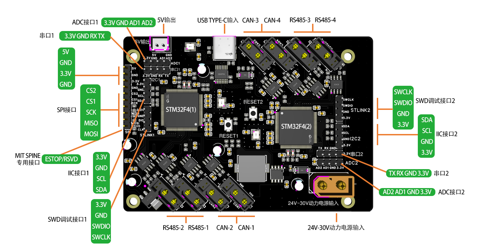
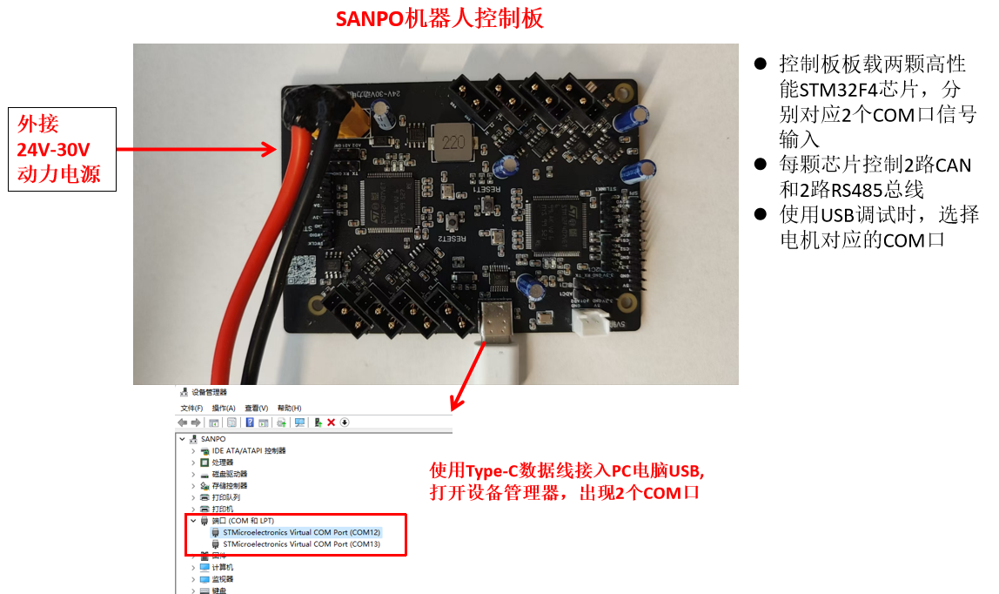
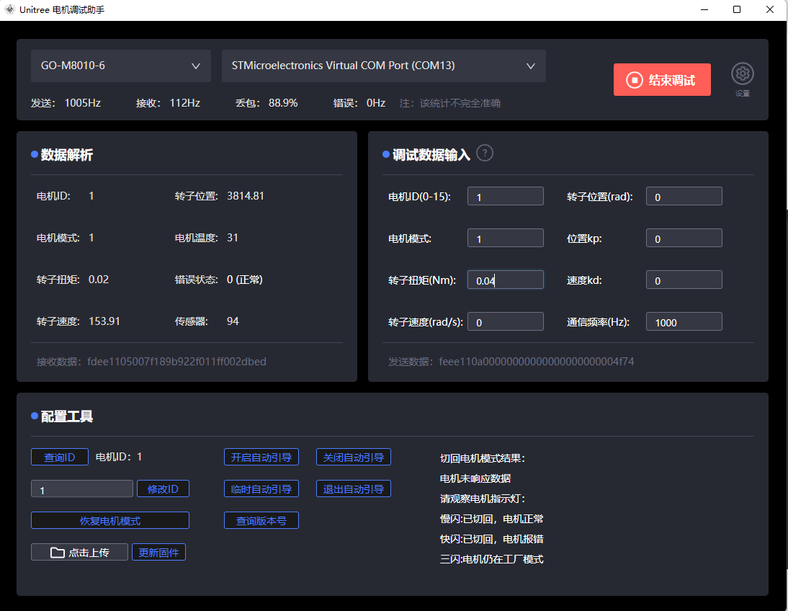
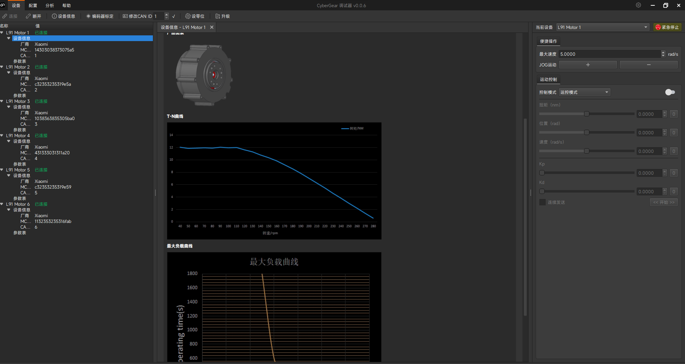
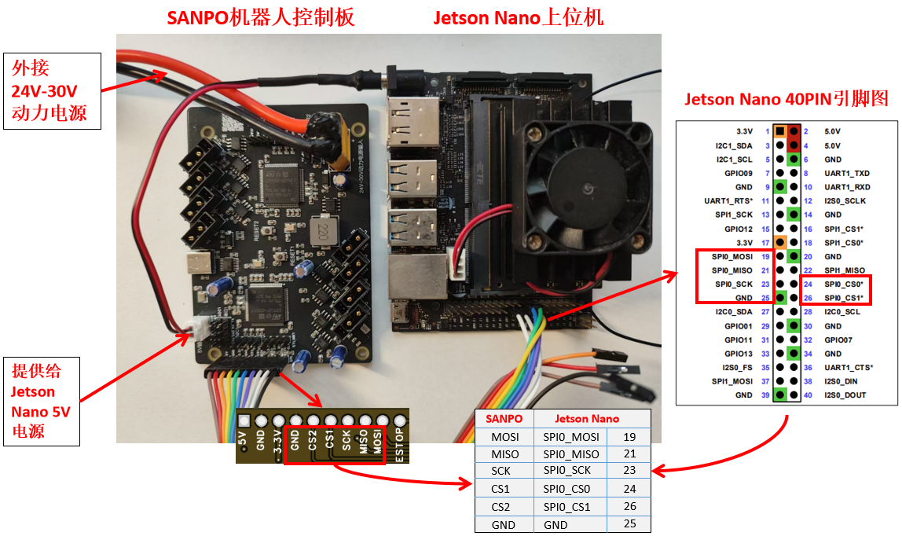
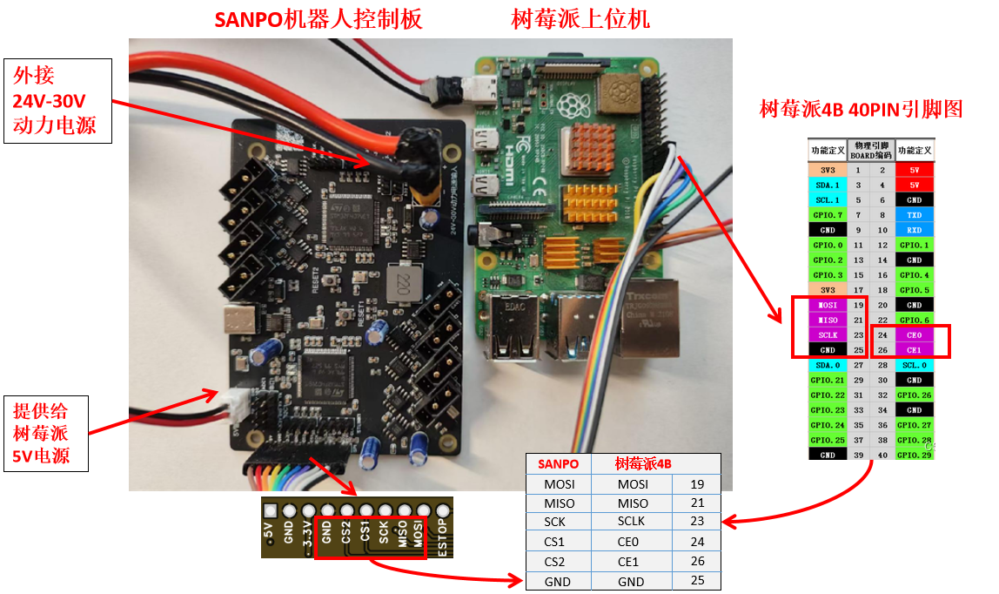
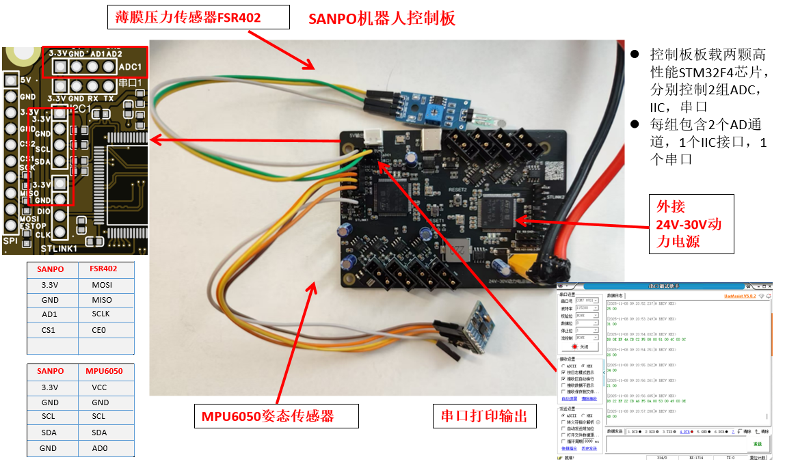
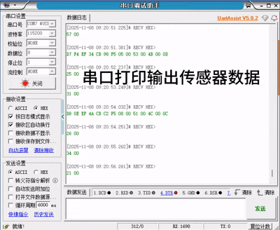

# SANPO兴普智能 - 机器人集成开发板

**[官方淘宝商城](https://item.taobao.com/item.htm?ft=t&id=979678214285)**
  
## 功能描述 ##
- 支持**4**路**CAN**总线，**4**路**RS485**总线
- 支持**小米CyberGear**，**宇树GM**系列等常用关节电机
- 支持**USB**控制输入
- 支持**SPI**控制输入
- 支持外接**IIC，ADC，串口**传感器设备
- 支持**5V/3.3V**电源输出，提供**树莓派，Nvidia Jetson**等上位机供电
- 兼容**MIT Cheetash SPINE**硬件设计标准

## 开发板设计架构 ##
- 开发板集成2个STM32F4模块。
- 一条腿（三个关节）为一路CAN/RS485，与STM32F4模块(Spine)进行通信，一个STM32F4(Spine)模块负责两条腿的CAN/RS485通信。
- 根据MIT Cheetash的设计标准，为了保证每路CAN的通信至少是1M。每个STM32F4有2路CAN，每一路负责三个电机的通讯可以达到1000Hz。
- 串口1，IIC接口1，ADC接口1与STM32F4(1)模块通信，串口2，IIC接口2，ADC接口2与STM32F4(2)通信。
- 二次开发时，可以通过SWD下载调试接口安装固件，SWD接口1对应STM32F4(1)模块，SWD接口2对应STM32F4(2)模块。([参考接口设计图](#p2))
- 原厂固件集成MPU050 IIC协议接入，FSR402 AD协议接入，可参考样例程序开发其他传感器协议接入。
- 上位机通过SPI与开发板通信时，CS1片选通道对应STM32F4(1)模块，CS2片选通道对应STM32F4(2)模块。

## 开发板接口图 ##

## 开发板3D模型图 ##
**[下载地址](https://gitcode.com/sanpo/robot/tree/main/3D_model/3D_SANPO_SPINE.step)**  

## 关节电机控制协议说明 ##
- **[USB转CAN总线电机](https://gitcode.com/sanpo/robot/blob/main/demo/README.md#p1)**
- **[USB转RS485总电机](https://gitcode.com/sanpo/robot/blob/main/demo/README.md#p2)**
- **[SPI转CAN总线电机](https://gitcode.com/sanpo/robot/blob/main/demo/README.md#p3)**
- **[SPI转RS485总电机](https://gitcode.com/sanpo/robot/blob/main/demo/README.md#p4)**

## 应用方案示例 ##
- **[示例方案一：机器人关节电机控制(USB控制输入)](#s1)**  
- **[示例方案二：机器人关节电机控制(SPI控制输入)](#s2)**  
- **[示例方案三：外接传感器(姿态传感器，压力传感器等)](#s3)**  
- **[示例方案四：MIT Cheetash SPINE固件](#s4)**  

##  示例方案一：机器人关节电机控制(USB控制输入) 
### 接线示例图

### 宇树电机官方调试软件  
**[下载地址](https://gitcode.com/sanpo/robot/blob/main/tools/UnitreeMotor.zip)**  
**[使用说明](https://support.unitree.com/home/zh/Motor_SDK_Dev_Guide/Motor_debugging_assistant)**  

 

### 小米CyberGear电机官方调试软件  
**[下载地址](https://gitcode.com/sanpo/robot/blob/main/tools/CyberGear.zip)**  
注意：保存路径中不能有中文，否则软件无法启动  
**[使用说明](https://gitcode.com/sanpo/robot/blob/main/tools/CyberGear.pdf)**  

 

##  示例方案二：机器人关节电机控制(SPI控制输入) 
### 接线示例图
### 1. Jetson Nano

### 2. 树莓派4B
  

### 示例演示
**[小米CyberGear电机Demo源代码下载](https://gitcode.com/sanpo/robot/blob/main/demo/spi_demo/cybergear)**  
**[宇树GO-GM8010-6电机Demo源代码下载](https://gitcode.com/sanpo/robot/blob/main/demo/spi_demo/unitree)**  

##  示例方案三：外接传感器(姿态传感器，压力传感器等) 
### 接线示例图
#### 1. IIC：MPU6050姿态传感器
#### 2. ADC：FSR402压力传感器

  

### 示例演示
MPU6050姿态传感器使用IIC接口接收数据，FSR402压力传感器使用ADC接口接收数据，串口用于输出传感器数据。  
传感器协议解析在STM32固件中实现，用户可以根据需要自定义传感器协议解析代码。  
**[固件源代码下载](https://gitcode.com/sanpo/robot/tree/main/firmware/STM32CubeIDE)**  
STM32固件更新参考  
**[如何更新固件](https://gitcode.com/sanpo/robot/tree/main/firmware)**  
注意：请选择SANPO原厂固件，MIT Cheetash SPINE固件不支持传感器接入。  

  

##  示例方案四：MIT Cheetash SPINE固件 
建议使用SANPO原厂固件，MIT Cheetash SPINE固件不支持USB和传感器接入，不支持小米CyberGear和宇树电机。  
使用[MIT Cheetash SPINE](https://gitcode.com/sanpo/robot/blob/main/firmware/mit_cheetash_spine)固件时，需要注意，SANPO开发板与MIT SPINE STM32芯片引脚定义的对应关系，如下表所示：  
|    功能     | SANPO开发板 | MIT SPINE |
| :---------- | :----------: | :---------: |
|   控制芯片   | STM32F407 | STM32F446 |
| 串口(TX)    | PA_6      | PC_2
| 串口(RX)    | PA_7      | PC_3
| CAN1(TX)   | PB_9      | PB_13
| CAN1(RX)   | PB_8      | PB_12
| CAN2(TX)   | PB_6      | PB_9
| CAN2(RX)   | PB_5      | PB_8
| SPI(MOSI)  | PC_12     | PA_7
| SPI(MISO)  | PC_11     | PA_6
| SPI(SCLK)  | PC_10     | PA_5
| SPI(CS)    | PA_15     | PA_4
| ESTOP      | PD_0      | PB_15