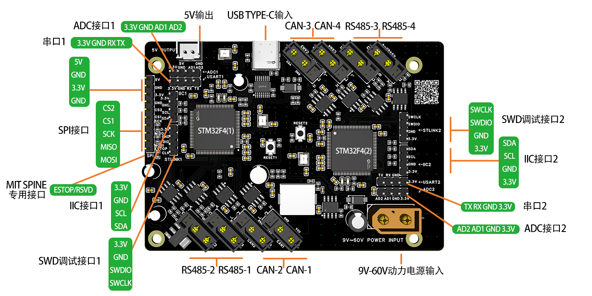

# Get Started

SANPO 机器人集成板使用于机器人、机器狗、机械臂等场景。集成 USB 和 SPI 数据输入接口，CAN/RS485 电机控制接口和各类传感器接口。

## Introduction

- 开发板集成 2 个 STM32F4 模块，每个模块负责 2 路 CAN 和 2 路 RS485，总计 4 路 CAN / 4 路 RS485。
- 支持 USB 和 SPI 作为上位机控制输入，同时支持 IIC、ADC、串口等传感器扩展。
- 提供 5V/3.3V 供电输出，可为树莓派、Nvidia Jetson 等上位机供电。
- 兼容 MIT Cheetash SPINE 硬件设计标准。

## Hardware

### USB 接入（PC/上位机）

- USB 作为控制输入时，可直接在 PC 上使用调试软件完成电机通信验证。
- USB 支持 CAN 与 RS485 协议，适合快速调试与验证。

### SPI 接入（Jetson/树莓派）

- SPI 作为控制输入时，CS1 对应 STM32F4(1) 模块，CS2 对应 STM32F4(2) 模块。
- 可参考仓库根目录的接口图进行连线。

## Software

调试工具建议如下：

- 小米电机官方调试软件（USB 转 CAN）：[小米 CyberGear 调试软件](../../tools/CyberGear.zip)。注意：保存路径中不能有中文，否则软件无法启动。
- 宇树电机官方调试软件（USB 转 RS485）：[宇树 GOM8010 调试软件](../../tools/UnitreeMotor.zip)。
- SANPO 关节电机调试软件（支持各类标准关节电机）：<a href="https://sanporobot.com/sanpo-studio" target="_blank" rel="noopener">Sanpo Studio Motor Tools</a>

## Build Your Program

协议定义与样例代码如下：

- [USB 转 CAN](usb_can)
- [USB 转 RS485](usb_rs485)
- [SPI 转 CAN](spi_can)
- [SPI 转 RS485](spi_rs485)

## Advanced

自定义固件与协议开发建议从原厂固件开始：

- 原厂固件（可二次开发）：[STM32CubeIDE 项目工程](https://gitcode.com/sanpo/robot/tree/main/firmware/STM32CubeIDE)
- MIT Cheetash SPINE 固件（学习用途）：[MBED STUDIO 项目工程](https://gitcode.com/sanpo/robot/tree/main/firmware/mit_cheetash_spine)

固件更新要点，详见[固件更新](firmware_update)：

- 使用 STLINK 连接板载 STM32F407 芯片 SWD 接口。
- 使用 STM32CubeProgrammer 刷写最新固件。
- 两颗 STM32F407 需要分别刷写对应固件。
