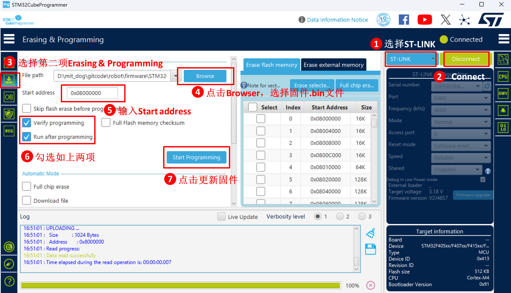

# SANPO兴普智能 - 机器人集成开发板

## 如何选择固件
开发板支持如下两种固件
### SANPO原厂开源固件
[源代码地址](https://gitcode.com/sanpo/robot/blob/main/firmware/STM32CubeIDE)  

适用场景：
1. 提供STM32CubeIDE开发工程源码，方便用户进行二次开发。
2. 集成FreeRTOS框架，支持实时多任务并发执行。
3. 同时支持CAN总线和RS485总线通信。
4. 支持USB，IIC，SPI，串口，ADC等接口，方便用户进行扩展。
5. 支持小米CyberGear，宇树电机通信协议和官方调试工具。

### MIT Cheetash SPINE固件
[源代码地址](https://gitcode.com/sanpo/robot/blob/main/firmware/mit_cheetash_spine)  
适用场景：学习Cheetash运动控制原理。  
提示：开发调试难度高，因为源代码MIT团队已不再维护，mbedos框架也已经停止维护，并且不支持常用电机通信协议，不建议用于实际项目开发。

## 如何更新固件
### SANPO原厂固件更新
1. 更新固件前，请准备好STLINK连接线，连接板载STM32芯片STLINK接口到PC。
2. 板载两个STLINK接口，分别对应两颗STM32F407芯片，用户需要根据开发板上的丝印，选择对应的STLINK接口。对两颗STM32F407芯片分别进行固件更新。
3. 下载ST官方提供的[STM32CubeProgrammer](https://gitcode.com/sanpo/robot/blob/main/firmware/tools/STM32CubeProgrammer_win64.zip)软件并且安装。
4. 下载最新的原厂固件  
**[sanpo_robot_spine_board_firmware-latest.bin](https://gitcode.com/sanpo/robot/blob/main/firmware/STM32CubeIDE/Release/sanpo_robot_spine_board_firmware-latest.bin)**
5. 使用STM32CubeProgrammer工具，将最新的原厂固件刷入开发板。  

  

### MIT Cheetash SPINE固件更新
1. 下载mbedos官方IDE工具[mbed studio](https://os.mbed.com/studio/)并且安装。
2. 打开mbed studio，选择File->Import Project，导入MIT Cheetash SPINE固件的源代码。
3. 使用STLINK连接线，连接板载STM32芯片STLINK接口到PC，选择Target->MCUs and custom targets->STM32F407VETx。
4. 点击Build program按钮，编译项目并将编译好的固件刷入开发板。

### 板载STM32芯片引脚定义完整图谱
- 板载芯片 STM32F407(1)
|     功能接口    | 引脚定义 | 对应STM32芯片引脚 |
| :---------- | :----------: | :---------: |
| ADC接口1    | AD1   | PB0
| ADC接口1    | AD2   | PB1
| 串口1       | TX    | PD8 
| 串口1       | RX    | PD9
| SPI接口     | CS1   | PA15
| SPI接口     | SCK  | PC10
| SPI接口     | MISO  | PC11
| SPI接口     | MOSI  | PC12
| 预留接口    | ESTOP/RSDV   | PD0
| IIC接口1    | SCL   | PB10
| IIC接口1    | SDA   | PB11
| SWD调试接口1  | SWDIO   | PA13
| SWD调试接口1  | SWCLK   | PA14
| RS485-2  | RX   | PC6
| RS485-2  | TX   | PC7
| RS485-1  | RX   | PB6
| RS485-1  | TX   | PB7
| CAN2   | RX   | PB12
| CAN2   | TX   | PB13
| CAN1   | RX   | PB8
| CAN1   | TX   | PB9

- 板载芯片 STM32F407(2)
|     功能接口    | 引脚定义 | 对应STM32芯片引脚 |
| :---------- | :----------: | :---------: |
| ADC接口2    | AD1   | PB0
| ADC接口2    | AD2   | PB1
| 串口2       | TX    | PD8 
| 串口2       | RX    | PD9
| SPI接口     | CS2   | PA15
| SPI接口     | SCK  | PC10
| SPI接口     | MISO  | PC11
| SPI接口     | MOSI  | PC12
| 预留接口    | ESTOP/RSDV   | PD0
| IIC接口2    | SCL   | PB10
| IIC接口2    | SDA   | PB11
| SWD调试接口2  | SWDIO   | PA13
| SWD调试接口2  | SWCLK   | PA14
| RS485-3  | RX   | PB6
| RS485-3  | TX   | PB7
| RS485-4  | RX   | PC6
| RS485-4  | TX   | PC7
| CAN3   | RX   | PB8
| CAN3   | TX   | PB9
| CAN4   | RX   | PB12
| CAN4   | TX   | PB13

