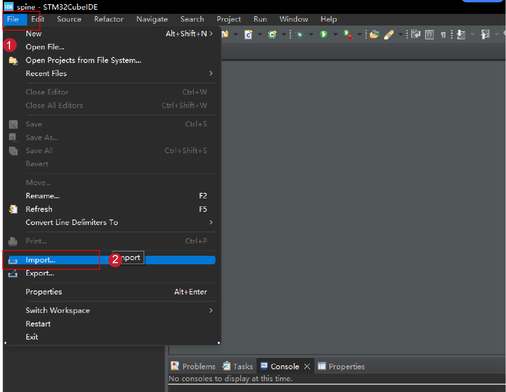
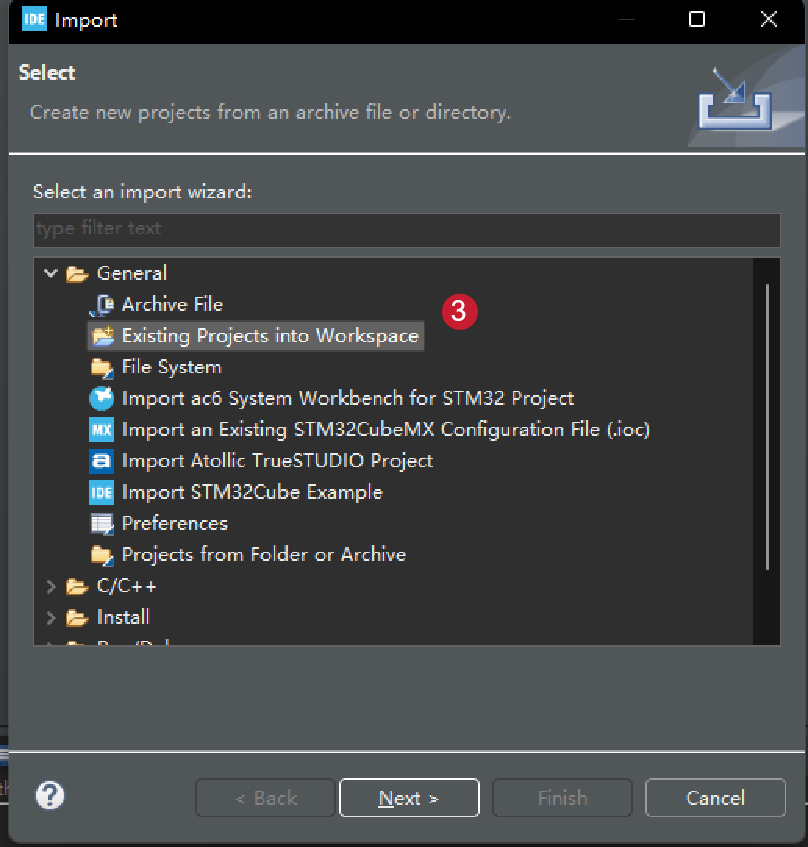
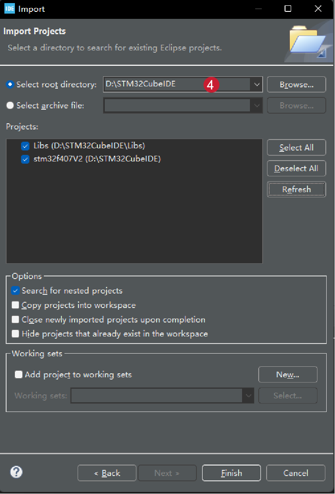
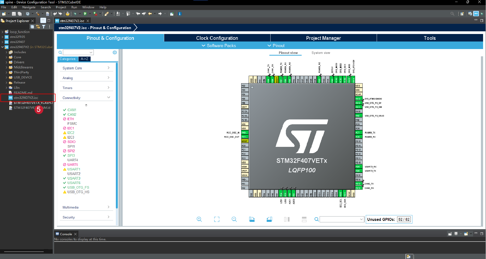

### SANPO机器人开发板专用固件
固件框架已开源，便于机器人项目用于二次开发。
开发板设计方案和应用场景，请参考
**[开发板使用说明](https://gitcode.com/sanpo/robot)**

- 该项目工程，使用STM32CubeIDE开发。
- 集成FreeRTOS框架
- 支持USB转多路CAN总线
- 支持USB转多路RS485总线
- 支持SPI转多路CAN总线
- 支持SPI转多路RS485总线
- 支持小米CyberGear电机官方调试软件通信协议
- 支持宇树电机官方调试软件通信协议
- 支持IIC接口协议
- 支持ADC接口协议
- 支持串口协议
- 支持MPU6050姿态传感器
- 支持FSR402压力传感器
- 支持串口输出传感器数据
- 支持24V-30V动力电源输入
- 支持5V电源输出
- 支持树莓派，Nvidia Jetson系列供电协议
- 支持STLINK调试接口协议

### 固件二次开发指南
1. 下载当前固件工程到本地PC。  
**[下载地址](https://gitcode.com/sanpo/robot/tree/main/firmware/STM32CubeIDE)**
2. 安装ST官方开发工具[STM32CubeIDE软件](https://www.st.com/en/development-tools/stm32cubeide.html)。
3. 导入固件工程。  
- 打开 文件->导入  

- 选择 导入现有项目  
  
- 选择 固件工程目录  
  
- 在左侧导航栏中 双击打开 stm32f407V2.ioc 文件，可以查看芯片的引脚定义，进行二次开发  
  
4. 开发完成，将编译成功的固件文件，下载到板载芯片，详情请查看[如何更新固件](https://gitcode.com/sanpo/robot/blob/main/firmware/README.md)  